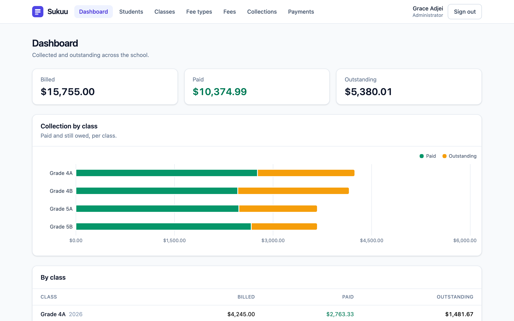
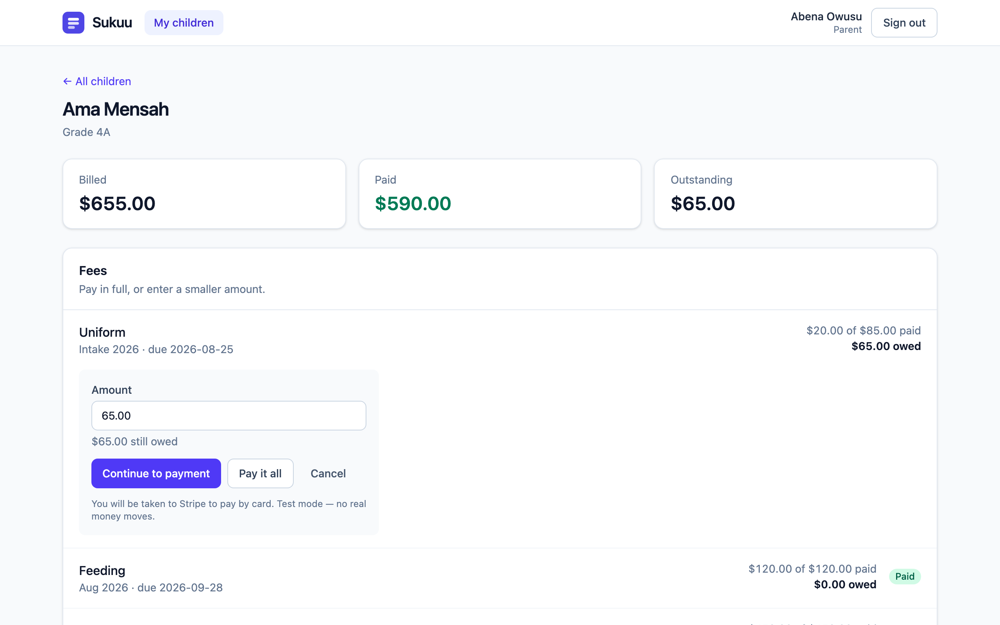
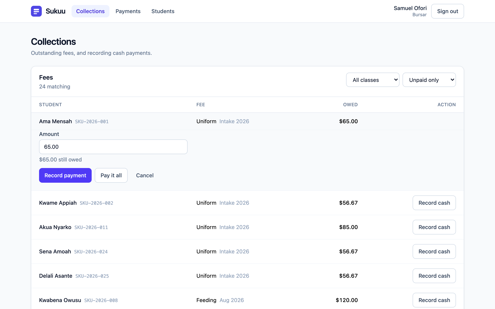
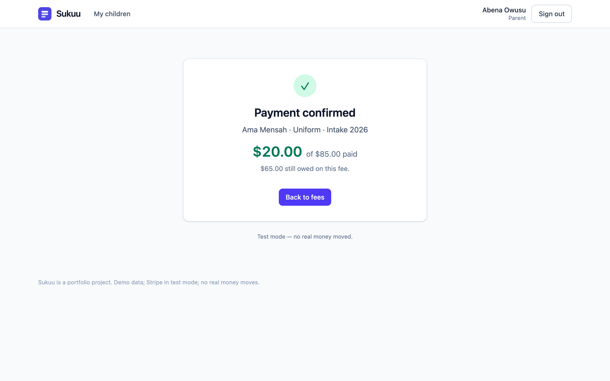
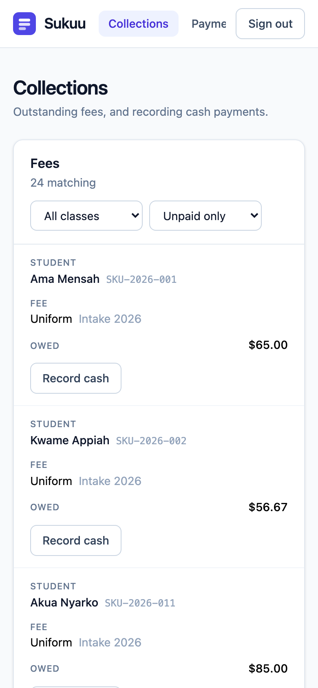
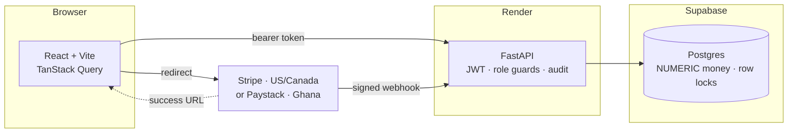

# Sukuu — school fee management

[](https://github.com/Rancho-1001/sukuu/actions/workflows/ci.yml)

Fees, installments, and payments for a primary school — with three roles the server actually enforces, and money that is never a float.

**Live demo: [sukuu-pi.vercel.app](https://sukuu-pi.vercel.app)**

| Role | Email | Password |
|---|---|---|
| Administrator | `admin@sukuu.demo` | `sukuu-demo` |
| Bursar | `bursar@sukuu.demo` | `sukuu-demo` |
| Parent | `parent@sukuu.demo` | `sukuu-demo` |

The API is on free hosting that sleeps after fifteen quiet minutes. A scheduled ping keeps it awake most of the time; if you do catch it cold, the first request takes about a minute, and the page says so. Card payments are Stripe test mode — use `4242 4242 4242 4242` with any future date. No real money moves.



## Why this exists

I taught in Ghana. Fee collection ran on a paper receipt book and a spreadsheet, and the bursar reconciled the two by hand at the end of each term. Parents paid in installments — a bit at the start of term, more when a harvest came in — and nobody could say with confidence who still owed what. *Sukuu* is "school" in Twi.

This is the system that office needed, built to demonstrate three things:

1. **Financial correctness.** Installments, partial payments, and a guarantee that two payments cannot overpay a fee even when they arrive at the same instant.
2. **Access control that is enforced, not implied.** Three roles with boundaries in the API, an audit trail, and a parent who cannot see another family's child no matter what URL they type.
3. **Real payments, reconciled properly.** Stripe Checkout, with the ledger written only by the signed webhook — never by the browser coming back.

## What it does

```
Admin sets up the school (classes, students, fee types)
  → charges a fee to one student, or a whole class at once
    → parents see itemised fees and what is still owed
      → payments arrive: cash at the office, or card via Stripe
        → the dashboard shows collected against outstanding, per class
```

<table>
<tr>
<td width="50%"><br><sub><b>Parent</b> — itemised fees per child, pay in full or choose an amount.</sub></td>
<td width="50%"><br><sub><b>Bursar</b> — who owes what, and a cash payment recorded in place.</sub></td>
</tr>
<tr>
<td><br><sub>After Stripe: the page says <i>confirmed</i> only once the webhook has landed.</sub></td>
<td><br><sub>A bursar at a school gate is on a phone. Tables stack into cards.</sub></td>
</tr>
</table>

## How it fits together



The dotted line is the one that matters: the browser's return from the processor is a *hint*, and the only thing that writes a payment is the signed webhook. Which processor is one environment variable on the API; the demo runs on Stripe.

## Decisions worth reading

These are the judgement calls. Each has a test that fails if the decision is undone, and most were verified by undoing them on purpose.

**Money is never a float — anywhere.** `NUMERIC(12,2)` in Postgres, `Decimal` in Python, and a *string* on the wire (`"250.00"`), because a JSON number becomes an IEEE 754 double the moment a browser parses it. In the frontend, nothing outside one module formats an amount, and comparisons go through integer cents. The one place a float exists is chart geometry, where it never reaches the screen.

**Two payments cannot overpay a fee, even at the same instant.** The payment service takes `SELECT … FOR UPDATE` on the fee assignment — the *parent* row, because the dangerous write is a new payment row, and a row that does not exist yet cannot be locked. Existing payments are read *after* the lock, never before. The test uses two independent database connections; through one session it passes whether or not the lock exists. I removed the lock and watched it fail.

**The ledger is written by the webhook, never by the redirect.** Anyone can type the success URL. So the success page does not say "paid" — it says "confirming", and watches the balance move past what it was when checkout began. Replays are no-ops via a unique index on `stripe_event_id`, proved in production by having Stripe redeliver the same event. An integrity error at that commit is only treated as a duplicate if the constraint is *that* index; anything else re-raises, because answering "already recorded" to a foreign-key failure would tell Stripe the money was handled and lose it behind a 200.

**Money that arrives but cannot be applied is flagged, not refused.** A bursar records cash while a parent is on the payment page; the card payment then overpays. A 409 would be a lie — the card is already charged and there is no smaller amount to retry. It is audited as `payment.online_needs_refund` for a human, and the invariant holds.

**The processor is an interface, and the second one proved it.** Stripe does not operate in Ghana and Paystack does not operate in Canada, so both sit behind one interface with two methods — open a checkout, verify a webhook — and `PAYMENT_GATEWAY` picks one. Everything after verification is shared: the idempotency key, the lock, the needs-refund path, the audit row. Adding Paystack touched no route and no test of the ledger; it added a module, a signing helper, and the tests for what differs — HMAC-SHA512 with no timestamp, a transaction reference instead of an event id, a mobile-money channel that the ledger records as *mobile money* rather than as the company that carried it. A gateway with no secret refuses every delivery with a 503, because an HMAC against an empty key is a signature anyone can produce.

**404, not 403, for another family's child.** A 403 confirms the record exists and lets a parent walk the IDs to learn the school roll. Role guards live in the API; the UI hiding a button is signposting, not security.

**Totals are computed without the fan-out.** Joining students to assignments to payments produces one row per *payment*, so a 250.00 bill paid in three installments counts as 750.00. The naive join agrees with a hand-check for everyone who paid in one go and is wrong only for installments — the feature the product exists for. Payments are collapsed to one row per assignment first. Verified by substituting the naive join: a class of three read 600.00 instead of 300.00.

**The login rate limiter counts rows in `audit_log`.** No new infrastructure, and the count is shared across processes — an in-memory counter hands an attacker one full allowance per worker.

**There are no DELETE endpoints.** Classes archive, students go inactive, fee types cannot be removed. A public demo cannot be wiped, structurally rather than carefully.

**CORS refuses to start on a wildcard.** `allow_credentials` is on, and browsers reject wildcard-with-credentials anyway — so a `*` would make every cross-origin request fail in a way that looks like a frontend bug. Failing at startup names the cause.

## Roles and permissions

| Capability | Admin | Bursar | Parent |
|---|:---:|:---:|:---:|
| Manage students and classes | ✅ | ❌ | ❌ |
| Define fee types; charge fees | ✅ | ❌ | ❌ |
| Record cash payments | ✅ | ✅ | ❌ |
| View all payments and reports | ✅ | ✅ | ❌ |
| View own children's fees and history | — | — | ✅ |
| Pay online | — | — | ✅ |

Every deny case has a test that fails if you delete the guard.

## Testing

**567 backend tests, 91 frontend.** Coverage across the money and permission code — the balance rules, the payment service, the ledger queries, both gateways, the webhook, the role guards — is **99%** (467 statements, 6 missed); 89% overall.

```bash
cd backend && pytest                     # everything, against real Postgres
cd backend && pytest tests/unit -q       # the money rules alone, no database
cd frontend && npm test
```

Three conventions carry the suite:

- **No SQLite substitute.** Tests run against the same Postgres the app uses. SQLite has neither `NUMERIC` semantics nor `SELECT … FOR UPDATE` — the two things the financial tests exist to check.
- **Every list endpoint asserts its query count stays flat** between a one-row page and a seven-row one. An N+1 is a count that tracks the result size; comparing two page sizes catches it without hard-coding a number.
- **Defences are verified by breaking them.** The lock, the fan-out fix, the idempotency guard, the form-reset bug — each has a test that was confirmed to fail with the defence removed before being kept.

The webhook tests sign their payloads with the real HMAC schemes — SHA-256 with a timestamp for Stripe, SHA-512 without one for Paystack — rather than patching verification out, so the tampered-body and stale-timestamp cases are actually exercised.

## Running it locally

Prerequisites: Python 3.14, Node 20+, PostgreSQL 16+. [uv](https://docs.astral.sh/uv/) installs Python 3.14 without touching the system one.

```bash
cd backend
uv venv --python 3.14 && source .venv/bin/activate
uv pip install -r requirements-dev.txt
cp .env.example .env      # DATABASE_URL, JWT_SECRET, Stripe test keys
alembic upgrade head && python -m app.db.seed
uvicorn app.main:app --reload
```

```bash
cd frontend
npm install && cp .env.example .env
npm run dev
```

API docs at `http://localhost:8000/docs`. For a real card payment locally, `stripe listen --forward-to localhost:8000/webhooks/stripe` and put the secret it prints in `.env`.

Deploying it — Vercel, Render, Supabase, and the two things that went wrong the first time — is in [docs/deploy.md](docs/deploy.md).

## Project structure

```
backend/app/
├── api/routes/    # HTTP endpoints, thin; every guard is a dependency
├── api/deps.py    # get_current_user, require_role, get_own_student
├── core/          # settings (CORS refuses wildcards), JWT, bcrypt
├── db/            # session, migrations, the seed
├── models/        # seven tables; money is NUMERIC(12,2)
├── schemas/       # Pydantic in and out; Money serialises as a string
└── services/
    ├── balances.py         # the money rules, pure, no database
    ├── payments.py         # the locked write path
    ├── ledger.py           # aggregations without the fan-out
    ├── gateways/           # one interface; stripe.py and paystack.py behind it
    └── rate_limit.py       # failed logins, counted from the audit log
frontend/src/
├── lib/money.ts   # the one door for formatting an amount
├── lib/api.ts     # token attachment; the two kinds of 401
├── auth/          # context and guards — what is shown, never what is allowed
└── pages/         # admin, staff, parent
```

## What was cut, and why

- **Opening a user account.** Families arrive through the seed script; an admin cannot onboard a new one end to end. Doing it properly needs creation, an invite, and a password-set flow — a larger piece than the parent picker that exposed the gap, and not something to smuggle in behind one.
- **Refunds and reversals.** The webhook flags an unapplyable payment for a human. A production system would call Stripe's refund API there; doing it automatically is not something to write without someone to answer for it.
- **Two guardians per student.** v1 models one parent. Real households often have two; that is a join table.
- **SMS and email reminders** — the most obvious next feature, and the one that would most change collection rates.
- **Attendance, grades, timetables, multi-school.** Not this product.

## Production notes

**Payment gateway.** Both markets are wired: `PAYMENT_GATEWAY=stripe` for the US and Canada, `PAYMENT_GATEWAY=paystack` for Ghana, where it offers mobile money — MTN MoMo, Telecel Cash — which is how most school fees there are actually paid. Going live on either needs a registered business; the code does not care which. The demo runs on Stripe because Stripe's test mode needs no paperwork.

**Currency.** Defaults to USD on Stripe and GHS on Paystack; `PAYMENT_CURRENCY` overrides (a Canadian school sets `cad`). The frontend's `VITE_CURRENCY` formats amounts and has to agree with it — the one setting a gateway switch touches on the frontend.

**Hosting.** Free Render instances sleep, and free Render Postgres *expires after 30 days* — which is why the database is Supabase. Both are in the deploy notes.

## History

The commit history is written to be read; each message explains the decision, not just the change. Phases 0–8 are checked off with their judgement calls in [docs/roadmap.md](docs/roadmap.md), which also lays out Part II — the phases between a demo and a product a school could run on.

## License

MIT — see [LICENSE](LICENSE).
